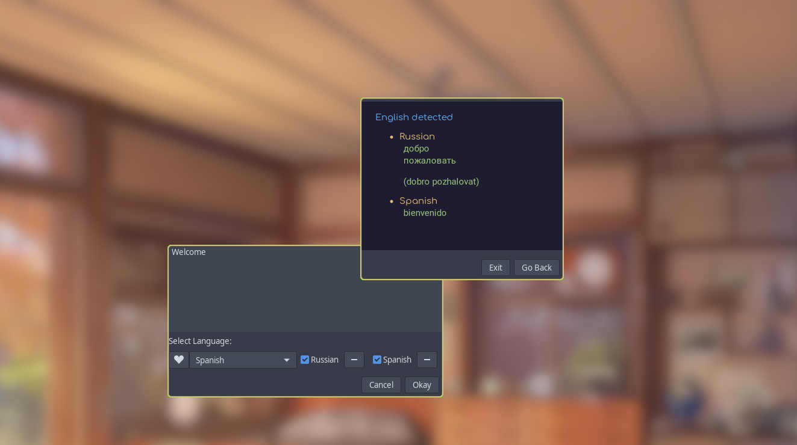

# YA Translator
## About
 YAT is a quick translation app that utilizes Azur Cognative Services to perform quick translations and transliterations. It supports upto 90 langauages with transliteration support for many of them. It is written in python and uses GTK3+ for the GUI

 

 ## Installation
 YAT is still in alpha development has quick or native installation methods yet, but you can run it for testing purposes. Bug reposts are welcome.
### Authentication
Before you can use the app, you need to be authenticated with Azure, with a key. A key can be provided upon request in special cases, but it is not a guarantee. We plan on creating a key for everyone to use so this step can be skipped, but until then you will have to create your own key. The full details on how to do so are layed out in [Microsoft Azure documentation](https://docs.microsoft.com/en-us/azure/cognitive-services/translator/translator-how-to-signup).  
Once you obtain the key, create a file called `env.json` the `lib` folder with the following contents:
```json
{
  "key": "<your authentication key>",
  "endpoint": "https://api.cognitive.microsofttranslator.com",
  "location": "<location chosen>"
}
```
 ### Setup
 First make sure you have Python 3.7+ and Pip installed.
 Clone this repository:
 ```
 git clone https://github.com/keystroke3/yat.git
 ```
 Go to the yat directory and run install `virtualenv`
```
pip install virtualenv
```
Create the virtual environment
```
python3 -m vitualenv .yatv
```
Actiave the envirnment and install required packages
```
source .yatv/bin/actiave
pip install -r requirements.txt
```

## Usage
Once done, you can finally start the application by running
```bash
python src/gui.py
```

Once started, you can choose the target language(s) by clicking on the drop down menu and selecting one. Click the heart button to add it to you list. To enable translation to a language, click on the check mark next to it. Conversely, to remove a language from the list, click on the minus(-) sign next to it. Type your text into the text box and click `okay` when ready. If everything is working correctly, the translation should pop up in 2-5 seconds.  
When finished, you can exit the app and run 
``` 
deactiavate
```
to exit out of the virtual environment.

## Todo
- Create error windows to inform user of issues
- Create plain text output for results in command mode
- Create a logo
- Create a launcher
- Create an installer
- Add clipboard support
- Make imporvements on speed
- Add settings panel
